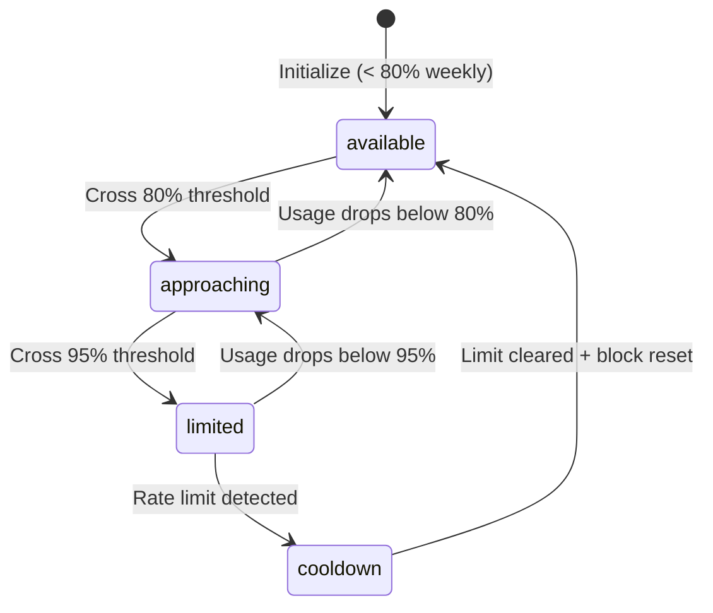
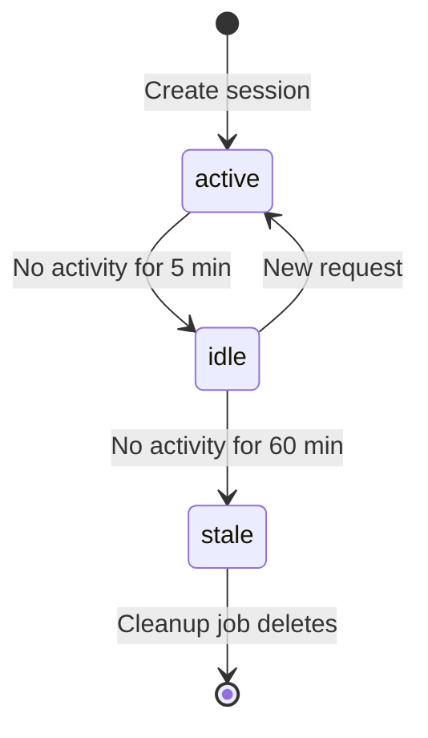

# Auth Pool Data Models

**Status:** 📋 Specification
**Last Updated:** 2026-01-28
**Purpose:** Define all TypeScript interfaces and data contracts

---

## Core Entities

### 1. Subscription

Represents a single Claude Pro/Max subscription account.

```typescript
interface Subscription {
  // Identity
  id: string;                    // Unique identifier (e.g., "sub1")
  email: string;                 // Account email
  type: 'claude-pro' | 'claude-max' | 'api';
  configDir: string;             // Path to Claude config (e.g., ~/.claude-sub1)

  // Current 5-hour block tracking
  currentBlockId: string | null; // ISO timestamp (e.g., "2026-01-28T15:00:00.000Z")
  currentBlockCost: number;      // USD spent in current block
  blockStartTime: number | null; // Timestamp (ms since epoch)
  blockEndTime: number | null;   // Timestamp (ms since epoch)

  // Weekly budget tracking
  weeklyBudget: number;          // USD (default 456 for Pro)
  weeklyUsed: number;            // USD spent in last 7 days

  // Allocation state
  assignedClients: string[];     // Session IDs
  maxClientsPerSub: number;      // Safeguard limit (default 15)

  // Health metrics
  healthScore: number;           // 0-100 (higher = healthier)
  status: SubscriptionStatus;

  // Burn rate (calculated from recent usage)
  burnRate: number;              // USD/hour
  tokensPerMinute: number;       // Tokens/minute

  // Metadata
  lastUsageUpdate: number;       // Timestamp of last usage tracking
  lastRequestTime: number;       // Timestamp of last request
  createdAt: number;             // Subscription registration time
}

type SubscriptionStatus =
  | 'available'    // < 80% weekly budget
  | 'approaching'  // 80-95% weekly budget
  | 'limited'      // > 95% weekly budget
  | 'cooldown';    // Rate limited by Anthropic
```

**Field Descriptions:**

- **currentBlockId:** Block identifier (ISO timestamp of block start). Null if no active block.
- **currentBlockCost:** Cumulative cost within the current 5-hour block. Resets when new block starts.
- **weeklyUsed:** Aggregated cost from last 7 days (rolling window).
- **healthScore:** Calculated by HealthCalculator. Used for allocation ranking.
- **burnRate:** Average USD/hour based on recent activity. Used for exhaustion prediction.
- **assignedClients:** List of active session IDs using this subscription.

**Validation Rules:**
```
weeklyBudget > 0
healthScore >= 0 AND healthScore <= 100
assignedClients.length <= maxClientsPerSub
currentBlockCost >= 0
weeklyUsed >= 0 AND weeklyUsed <= weeklyBudget (soft limit)
```

---

### 2. ClientSession

Represents a client's session and its subscription assignment.

```typescript
interface ClientSession {
  // Identity
  id: string;                    // Session ID (from client request)
  subscriptionId: string;        // Assigned subscription

  // Allocation metadata
  allocatedAt: number;           // Timestamp (when assigned)
  lastActivity: number;          // Timestamp (last request)
  status: SessionStatus;

  // Usage tracking (session-specific)
  sessionCost: number;           // Cumulative USD for this session
  sessionTokens: number;         // Cumulative tokens for this session
  requestCount: number;          // Number of requests in session

  // Client metadata (optional)
  clientIp?: string;             // For auditing
  userAgent?: string;            // For debugging
}

type SessionStatus =
  | 'active'   // Recently used (< 5 minutes)
  | 'idle'     // No activity 5-60 minutes
  | 'stale';   // No activity > 60 minutes (eligible for cleanup)
```

**Field Descriptions:**

- **sessionCost:** Tracked per-session. Used for debugging and client-level reporting.
- **status:** Auto-calculated based on `lastActivity`:
  - `active`: `NOW() - lastActivity < 5 minutes`
  - `idle`: `5 minutes <= (NOW() - lastActivity) < 60 minutes`
  - `stale`: `NOW() - lastActivity >= 60 minutes`

**Validation Rules:**
```
sessionCost >= 0
sessionTokens >= 0
requestCount >= 0
lastActivity <= NOW()
allocatedAt <= lastActivity
```

---

### 3. UsageRecord

Time-series record of usage events.

```typescript
interface UsageRecord {
  // Identity
  subscriptionId: string;        // Which subscription
  timestamp: number;             // When (ms since epoch)
  blockId: string;               // Which 5-hour block

  // Cost and tokens (from Claude CLI JSON)
  costUSD: number;
  inputTokens: number;
  outputTokens: number;
  cacheCreationTokens: number;
  cacheReadTokens: number;
  totalTokens: number;

  // Model breakdown (optional)
  modelUsage?: ModelUsageDetail[];

  // Request metadata
  sessionId?: string;            // Which session generated this
  durationMs?: number;           // Request duration
  uuid?: string;                 // Claude request UUID
}

interface ModelUsageDetail {
  model: string;                 // e.g., "claude-sonnet-4-5"
  inputTokens: number;
  outputTokens: number;
  cost: number;
}
```

**Storage Key Pattern:**
```
usage:{subscriptionId}:{timestamp}
// Example: usage:sub1:1738070000000
```

**Validation Rules:**
```
costUSD >= 0
totalTokens = inputTokens + outputTokens + cacheCreationTokens + cacheReadTokens
timestamp > 0
```

**Retention Policy:**
- Keep records for 30 days
- Purge records older than 30 days (background job)

---

### 4. BlockInfo

Represents a 5-hour billing block.

```typescript
interface BlockInfo {
  id: string;                    // ISO timestamp (e.g., "2026-01-28T15:00:00.000Z")
  startTime: number;             // Timestamp (ms since epoch)
  endTime: number;               // Timestamp (ms since epoch)
  isActive: boolean;             // Is this the current block?

  // Aggregated usage
  totalCost: number;             // USD
  totalTokens: number;           // All tokens
  requestCount: number;          // Number of requests

  // Burn rate (calculated)
  tokensPerMinute: number;
  costPerHour: number;

  // Projection (optional)
  projectedCost?: number;        // Estimated cost if burn rate continues
  remainingMinutes?: number;     // Time left in block
}
```

**Calculation:**
```
blockStartHour = floor(currentHour / 5) * 5
startTime = new Date(currentDate).setUTCHours(blockStartHour, 0, 0, 0)
endTime = startTime + (5 * 60 * 60 * 1000)  // 5 hours
isActive = NOW() >= startTime AND NOW() < endTime
```

---

## Request/Response Types

### 5. AllocationRequest

Client request for subscription allocation.

```typescript
interface AllocationRequest {
  sessionId?: string;            // Optional: resume existing session
  estimatedTokens: number;       // Estimated request size
  priority?: 'high' | 'normal' | 'low'; // Future use
}
```

---

### 6. AllocationResult

Response with allocated subscription.

```typescript
interface AllocationResult {
  type: 'subscription' | 'fallback';

  // If type === 'subscription'
  subscriptionId?: string;
  configDir?: string;
  subscriptionEmail?: string;
  sessionId: string;             // Assigned or resumed
  expiresAt?: number;            // Session expiration

  // If type === 'fallback'
  fallbackProvider?: string;     // e.g., "openrouter-glm"
  reason: string;                // Why fallback was used

  // Metadata
  healthScore?: number;          // Selected subscription's health
  weeklyPercentUsed?: number;    // For client awareness
}
```

**Example (Subscription):**
```json
{
  "type": "subscription",
  "subscriptionId": "sub1",
  "configDir": "/Users/vmks/.claude-sub1",
  "subscriptionEmail": "user1@example.com",
  "sessionId": "ses_abc123",
  "healthScore": 78.5,
  "weeklyPercentUsed": 42.0
}
```

**Example (Fallback):**
```json
{
  "type": "fallback",
  "fallbackProvider": "openrouter-glm",
  "reason": "All subscriptions exceeded safeguard thresholds",
  "sessionId": "ses_fallback_xyz"
}
```

---

### 7. UsageReportRequest

Request to report usage after request completes.

```typescript
interface UsageReportRequest {
  subscriptionId: string;
  sessionId: string;
  cost: number;                  // From claude_metadata.cost
  tokens: TokenUsage;            // From claude_metadata.usage
  durationMs?: number;
  model?: string;
}

interface TokenUsage {
  inputTokens: number;
  outputTokens: number;
  cacheCreationTokens: number;
  cacheReadTokens: number;
}
```

---

## Event Types

### 8. NotificationEvent

Base type for all notification events.

```typescript
type NotificationEvent =
  | RotationEvent
  | FailoverEvent
  | ThresholdEvent
  | LimitReachedEvent;

interface RotationEvent {
  type: 'rotation';
  timestamp: number;
  sessionId: string;
  fromSubscription: string;
  toSubscription: string;
  reason: string;                // e.g., "Load balancing"
}

interface FailoverEvent {
  type: 'failover';
  timestamp: number;
  sessionId: string;
  fromSubscription: string;
  toProvider: string;            // e.g., "openrouter-glm"
  reason: string;                // e.g., "Subscription exhausted"
}

interface ThresholdEvent {
  type: 'usage_threshold';
  timestamp: number;
  subscriptionId: string;
  weeklyUsed: number;
  weeklyBudget: number;
  percentUsed: number;
  estimatedTimeRemaining: string; // Human-readable (e.g., "3 hours")
}

interface LimitReachedEvent {
  type: 'limit_reached';
  timestamp: number;
  subscriptionId: string;
  limitType: 'weekly' | 'block' | 'clients';
  currentValue: number;
  limitValue: number;
}
```

---

### 9. RebalanceReport

Result of rebalancing cycle.

```typescript
interface RebalanceReport {
  timestamp: number;
  subscriptionsEvaluated: number;
  imbalanceDetected: boolean;

  // Rebalancing actions
  clientsMoved: number;
  movementDetails?: Array<{
    sessionId: string;
    fromSubscription: string;
    toSubscription: string;
    reason: string;
  }>;

  // Health scores before/after
  healthScoresBefore: Record<string, number>; // subscriptionId → score
  healthScoresAfter: Record<string, number>;

  // Duration
  durationMs: number;
}
```

---

## Configuration Types

### 10. PoolConfig

Main configuration for auth pool.

```typescript
interface PoolConfig {
  // Subscriptions
  subscriptions: SubscriptionConfig[];

  // Safeguards
  maxClientsPerSubscription: number;       // Default 15
  weeklyBudgetThreshold: number;           // Default 0.85 (85%)
  fallbackWhenExhausted: boolean;          // Default true

  // Rebalancing
  rebalancing: {
    enabled: boolean;                      // Default true
    intervalSeconds: number;               // Default 300 (5 min)
    costGapThreshold: number;              // Default 5.00 USD
    maxClientsToMovePerCycle: number;      // Default 3
  };

  // Notifications
  notifications: {
    webhookUrl?: string;
    sentryDsn?: string;
    rules: NotificationRule[];
  };
}

interface SubscriptionConfig {
  id: string;
  email: string;
  type: 'claude-pro' | 'claude-max' | 'api';
  configDir: string;
  weeklyBudget: number;                    // Default 456 for Pro
  maxClientsPerSub?: number;               // Override global default
}

interface NotificationRule {
  type: 'usage_threshold' | 'failover' | 'rotation' | 'limit_reached';
  threshold?: number;                      // For usage_threshold: 0.8 = 80%
  channels: ('webhook' | 'log' | 'sentry')[];
  enabled: boolean;
}
```

---

## Helper Types

### 11. HealthScoreBreakdown

Detailed explanation of health score calculation.

```typescript
interface HealthScoreBreakdown {
  finalScore: number;                      // 0-100
  components: {
    weeklyUsagePenalty: number;            // -XX points
    blockUsagePenalty: number;             // -XX points
    clientCountPenalty: number;            // -XX points
    burnRatePenalty: number;               // -XX points
    idleBonus: number;                     // +XX points
  };
  explanation: string[];                   // Human-readable breakdown
}
```

**Example:**
```json
{
  "finalScore": 65.4,
  "components": {
    "weeklyUsagePenalty": -21.0,
    "blockUsagePenalty": -9.0,
    "clientCountPenalty": -10.0,
    "burnRatePenalty": -4.6,
    "idleBonus": 0
  },
  "explanation": [
    "Base score: 100",
    "Weekly usage (42%): -21.0 points (42 * 0.5)",
    "Block usage (30%): -9.0 points (30 * 0.3)",
    "Assigned clients (2): -10.0 points (2 * 5)",
    "Burn rate (5.3 USD/h): -4.6 points ((5.3 - 3.0) * 2)",
    "Final score: 65.4"
  ]
}
```

---

## State Transitions

### Subscription Status State Machine



### Session Status Transitions



---

## Database Schema (Cloudflare Durable Object)

### Storage Keys

```
// Subscriptions
subscription:{id}                → Subscription

// Sessions
session:{sessionId}              → ClientSession
index:sessions_by_sub:{subId}   → string[] (session IDs)

// Usage records
usage:{subId}:{timestamp}        → UsageRecord
index:usage_by_day:{YYYYMMDD}   → string[] (subscription IDs with usage)

// Active blocks (cache)
block:{subId}:active             → BlockInfo

// Config
config:pool                      → PoolConfig
```

### Indexes

**Purpose:** Fast lookups

- **sessions_by_sub:** Find all sessions for a subscription
- **usage_by_day:** Find subscriptions with usage on a given day

---

## Type Exports

```typescript
// src/lib/auth-pool/types.ts

export type {
  // Core entities
  Subscription,
  SubscriptionStatus,
  ClientSession,
  SessionStatus,
  UsageRecord,
  ModelUsageDetail,
  BlockInfo,

  // Request/Response
  AllocationRequest,
  AllocationResult,
  UsageReportRequest,
  TokenUsage,

  // Events
  NotificationEvent,
  RotationEvent,
  FailoverEvent,
  ThresholdEvent,
  LimitReachedEvent,
  RebalanceReport,

  // Configuration
  PoolConfig,
  SubscriptionConfig,
  NotificationRule,

  // Helpers
  HealthScoreBreakdown,
};
```

---

## Validation Schemas (Zod)

```typescript
// For runtime validation

import { z } from 'zod';

export const SubscriptionSchema = z.object({
  id: z.string().min(1),
  email: z.string().email(),
  type: z.enum(['claude-pro', 'claude-max', 'api']),
  configDir: z.string(),
  currentBlockId: z.string().nullable(),
  currentBlockCost: z.number().nonnegative(),
  blockStartTime: z.number().nullable(),
  blockEndTime: z.number().nullable(),
  weeklyBudget: z.number().positive(),
  weeklyUsed: z.number().nonnegative(),
  assignedClients: z.array(z.string()),
  maxClientsPerSub: z.number().int().positive(),
  healthScore: z.number().min(0).max(100),
  status: z.enum(['available', 'approaching', 'limited', 'cooldown']),
  burnRate: z.number().nonnegative(),
  tokensPerMinute: z.number().nonnegative(),
  lastUsageUpdate: z.number(),
  lastRequestTime: z.number(),
  createdAt: z.number(),
});

export const AllocationRequestSchema = z.object({
  sessionId: z.string().optional(),
  estimatedTokens: z.number().int().positive(),
  priority: z.enum(['high', 'normal', 'low']).optional(),
});

// ... (more schemas for other types)
```

---

**Document Status:** ✅ Data Models Complete - Ready for Project Structure
