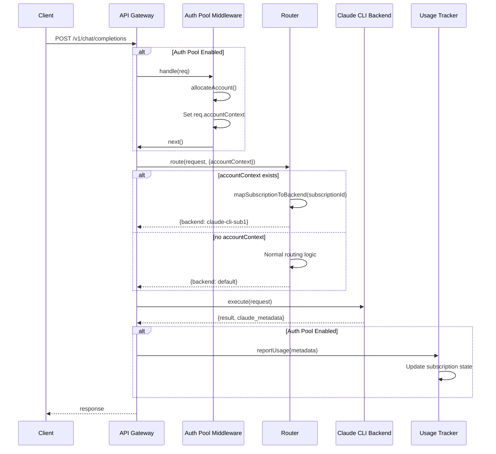

# Auth Pool Integration Plan

**Status:** 🔗 Integration Specification
**Last Updated:** 2026-01-28
**Purpose:** Step-by-step integration with anthropic-headless-api

---

## Overview

**Integration Type:** Middleware layer (extends existing API)
**Backward Compatibility:** 100% (opt-in via configuration)
**Breaking Changes:** None

---

## Integration Points

### 1. Main Entry Point (`src/index.ts`)

**Current State:**
```typescript
// Existing API initialization
app.post('/v1/chat/completions', chatHandler);
```

**After Integration:**
```typescript
import { AuthPoolMiddleware } from './lib/auth-pool';

// Initialize auth pool (conditional)
let authPool = null;
if (config.authPool?.enabled) {
  authPool = new AuthPoolMiddleware(poolConfig);
  await authPool.initialize();
}

// Add middleware
app.use((req, res, next) => {
  if (authPool) {
    return authPool.handle(req, res, next);
  }
  next();
});

// Shutdown handler
process.on('SIGTERM', async () => {
  if (authPool) {
    await authPool.shutdown();
  }
});
```

**Lines Changed:** +15 lines

---

### 2. Chat Route (`src/routes/chat.ts`)

**Current State:**
```typescript
export async function chatHandler(req, res) {
  const body = parseRequest(req);

  const decision = await router.route(body, {
    explicitBackend: body.backend
  });

  const response = await router.execute(body, decision);

  res.json(response);
}
```

**After Integration:**
```typescript
export async function chatHandler(req, res) {
  const body = parseRequest(req);

  // NEW: Get account context from middleware
  const accountContext = req.accountContext;

  const decision = await router.route(body, {
    explicitBackend: body.backend,
    accountContext: accountContext  // NEW
  });

  const response = await router.execute(body, decision);

  // NEW: Report usage if using auth pool
  if (accountContext && response.claude_metadata) {
    await req.app.authPool?.reportUsage({
      subscriptionId: accountContext.subscriptionId,
      sessionId: accountContext.sessionId,
      cost: response.claude_metadata.cost,
      tokens: response.claude_metadata.usage,
      model: response.model
    });
  }

  res.json(response);
}
```

**Lines Changed:** +15 lines

---

### 3. Router (`src/lib/router.ts`)

**Current Interface:**
```typescript
interface RoutingOptions {
  explicitBackend?: string;
  allowFallback?: boolean;
}
```

**After Integration:**
```typescript
interface RoutingOptions {
  explicitBackend?: string;
  allowFallback?: boolean;
  accountContext?: {          // NEW
    subscriptionId: string;
    configDir: string;
    sessionId: string;
  };
}
```

**Routing Logic:**
```typescript
async route(request, options): Promise<RoutingDecision> {
  // NEW: Auth pool takes precedence
  if (options.accountContext) {
    const backend = this.mapSubscriptionToBackend(options.accountContext.subscriptionId);
    if (backend) {
      return {
        backend,
        reason: `Auth pool allocated subscription ${options.accountContext.subscriptionId}`,
        isFallback: false,
        estimatedCost: backend.estimateCost(request)
      };
    }
  }

  // EXISTING: Normal routing logic
  if (options.explicitBackend) {
    // ...
  }

  // ...
}

// NEW: Helper method
private mapSubscriptionToBackend(subscriptionId: string): BackendAdapter | undefined {
  const backends = this.backendRegistry.getAllBackends();
  return backends.find(b => b.config.subscriptionId === subscriptionId);
}
```

**Lines Changed:** +25 lines

---

### 4. Backend Registry (`src/lib/backend-registry.ts`)

**Current BackendConfig:**
```typescript
interface BackendConfig {
  name: string;
  type: string;
  configDir?: string;
  provider?: string;
  // ...
}
```

**After Integration:**
```typescript
interface BackendConfig {
  name: string;
  type: string;
  configDir?: string;
  provider?: string;
  subscriptionId?: string;  // NEW: Link to auth pool subscription
  // ...
}
```

**Lines Changed:** +1 line

---

### 5. Configuration (`config/backends.json`)

**Current Structure:**
```json
{
  "backends": [
    {
      "name": "claude-cli-default",
      "type": "claude-cli",
      "configDir": "~/.claude"
    }
  ],
  "routing": {
    "defaultBackend": "claude-cli-default"
  }
}
```

**After Integration:**
```json
{
  "backends": [
    {
      "name": "claude-cli-sub1",
      "type": "claude-cli",
      "configDir": "/Users/vmks/.claude-sub1",
      "subscriptionId": "sub1"
    },
    {
      "name": "claude-cli-sub2",
      "type": "claude-cli",
      "configDir": "/Users/vmks/.claude-sub2",
      "subscriptionId": "sub2"
    },
    {
      "name": "openrouter-fallback",
      "type": "api",
      "provider": "openrouter"
    }
  ],
  "routing": {
    "defaultBackend": "claude-cli-sub1",
    "fallbackChain": ["openrouter-fallback"]
  },
  "authPool": {
    "enabled": true,
    "configPath": "config/auth-pool.yaml"
  }
}
```

**Lines Changed:** +10 lines

---

## New Configuration File

### `config/auth-pool.yaml`

```yaml
subscriptions:
  - id: sub1
    email: user1@example.com
    type: claude-pro
    configDir: /Users/vmks/.claude-sub1
    weeklyBudget: 456.00

  - id: sub2
    email: user2@example.com
    type: claude-pro
    configDir: /Users/vmks/.claude-sub2
    weeklyBudget: 456.00

safeguards:
  maxClientsPerSubscription: 15
  weeklyBudgetThreshold: 0.85
  fallbackWhenExhausted: true

rebalancing:
  enabled: true
  intervalSeconds: 300
  costGapThreshold: 5.00
  maxClientsToMovePerCycle: 3

notifications:
  webhookUrl: https://your-webhook.com/notify
  rules:
    - type: usage_threshold
      threshold: 0.80
      channels: [webhook, log]
      enabled: true

    - type: usage_threshold
      threshold: 0.90
      channels: [webhook, sentry]
      enabled: true

    - type: failover
      channels: [webhook, sentry]
      enabled: true

    - type: rotation
      channels: [log]
      enabled: true
```

---

## Migration Steps

### Phase 1: Preparation (No Code Changes)

1. **Create subscription configs:**
   ```bash
   mkdir -p ~/.claude-sub1
   mkdir -p ~/.claude-sub2
   cp ~/.claude/settings.json ~/.claude-sub1/
   cp ~/.claude/settings.json ~/.claude-sub2/
   ```

2. **Authenticate each subscription:**
   ```bash
   CLAUDE_CONFIG_DIR=~/.claude-sub1 claude login
   CLAUDE_CONFIG_DIR=~/.claude-sub2 claude login
   ```

3. **Test each subscription:**
   ```bash
   CLAUDE_CONFIG_DIR=~/.claude-sub1 claude ask "Hello"
   CLAUDE_CONFIG_DIR=~/.claude-sub2 claude ask "Hello"
   ```

### Phase 2: Code Implementation

**Order of Implementation:**

1. Create `src/lib/auth-pool/` module (all files from PSEUDOCODE.md)
2. Modify `src/lib/backend-registry.ts` (add subscriptionId field)
3. Modify `src/lib/router.ts` (add accountContext param)
4. Modify `src/routes/chat.ts` (add usage reporting)
5. Modify `src/index.ts` (add middleware)
6. Create `config/auth-pool.yaml`
7. Update `config/backends.json`

### Phase 3: Testing

1. **Unit tests:** Test all auth-pool modules
2. **Integration tests:** Test allocation flow
3. **E2E tests:** Test full request cycle with real Claude CLI

### Phase 4: Deployment

1. **Development:** Test with MemoryStore
2. **Staging:** Test with 2 subscriptions
3. **Production:** Enable for all subscriptions

---

## Backward Compatibility

### Without Auth Pool (Default)

```json
{
  "backends": [
    {
      "name": "claude-cli-default",
      "type": "claude-cli",
      "configDir": "~/.claude"
    }
  ],
  "authPool": {
    "enabled": false
  }
}
```

**Behavior:** Works exactly as before (no changes)

### With Auth Pool (Opt-In)

```json
{
  "authPool": {
    "enabled": true,
    "configPath": "config/auth-pool.yaml"
  }
}
```

**Behavior:** Auth pool manages subscriptions

---

## Error Handling

### Scenario 1: Auth Pool Initialization Fails

**Behavior:** API starts WITHOUT auth pool (falls back to normal routing)

```typescript
try {
  authPool = new AuthPoolMiddleware(poolConfig);
  await authPool.initialize();
} catch (error) {
  console.error('Auth pool initialization failed:', error);
  console.warn('Starting API without auth pool');
  authPool = null;
}
```

### Scenario 2: Allocation Fails

**Behavior:** Request proceeds without accountContext (router uses default backend)

```typescript
try {
  accountContext = await authPool.allocateAccount(sessionId);
} catch (error) {
  console.error('Allocation failed:', error);
  // Continue without accountContext
}
```

### Scenario 3: Usage Reporting Fails

**Behavior:** Error logged, but response still returned to client

```typescript
try {
  await authPool.reportUsage(data);
} catch (error) {
  console.error('Usage reporting failed:', error);
  // Don't block response
}
```

---

## Request Flow Diagram



---

## Configuration Validation

**Startup Checks:**

1. **Subscription configs exist:**
   ```typescript
   for (const sub of config.subscriptions) {
     if (!fs.existsSync(sub.configDir)) {
       throw new Error(`Config dir not found: ${sub.configDir}`);
     }
   }
   ```

2. **Backend mapping complete:**
   ```typescript
   for (const sub of config.subscriptions) {
     const backend = backends.find(b => b.subscriptionId === sub.id);
     if (!backend) {
       throw new Error(`No backend found for subscription: ${sub.id}`);
     }
   }
   ```

3. **Notification webhook reachable (if configured):**
   ```typescript
   if (config.notifications.webhookUrl) {
     await testWebhook(config.notifications.webhookUrl);
   }
   ```

---

## Monitoring & Observability

### Metrics to Track

1. **Allocation metrics:**
   - Allocations per subscription
   - Average health score
   - Fallback rate

2. **Usage metrics:**
   - Weekly usage per subscription
   - Burn rate trends
   - Block cost distribution

3. **Rebalancing metrics:**
   - Rebalancing cycles
   - Clients moved
   - Cost gap reduction

### Logging Points

```typescript
// Allocation
LOG.info('Allocated subscription', {
  subscriptionId: result.subscriptionId,
  healthScore: result.healthScore,
  weeklyPercent: result.weeklyPercentUsed
});

// Usage tracking
LOG.info('Usage recorded', {
  subscriptionId: data.subscriptionId,
  cost: data.cost,
  tokens: data.tokens.inputTokens + data.tokens.outputTokens
});

// Rebalancing
LOG.info('Rebalancing complete', {
  clientsMoved: report.clientsMoved,
  durationMs: report.durationMs
});

// Errors
LOG.error('Allocation failed', {
  error: error.message,
  requestId: req.id
});
```

---

## Rollback Plan

### Disable Auth Pool

1. **Update config:**
   ```json
   {
     "authPool": {
       "enabled": false
     }
   }
   ```

2. **Restart API:**
   ```bash
   pm2 restart anthropic-headless-api
   ```

3. **Verify:** Requests route to default backend

### Complete Removal

1. Remove `src/lib/auth-pool/` directory
2. Revert changes to `src/index.ts`, `src/routes/chat.ts`, `src/lib/router.ts`
3. Remove `config/auth-pool.yaml`
4. Update `config/backends.json`

---

## Testing Checklist

- [ ] Unit tests pass for all auth-pool modules
- [ ] Integration tests verify allocation flow
- [ ] E2E tests confirm request completion
- [ ] Backward compatibility verified (auth pool disabled)
- [ ] Multiple subscriptions work correctly
- [ ] Rebalancing executes without errors
- [ ] Notifications sent correctly (webhook, Sentry)
- [ ] Failover to API backend works
- [ ] Session continuity maintained across rotations
- [ ] Usage tracking accurate (compared to Claude CLI output)

---

**Document Status:** ✅ Integration Plan Complete - Ready for Testing Strategy
