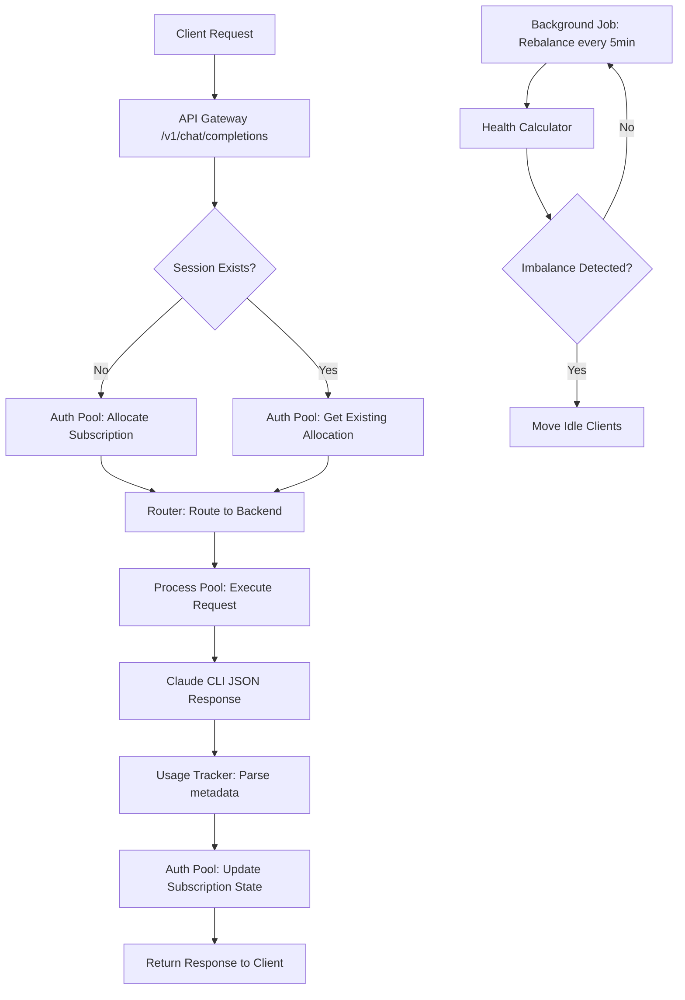
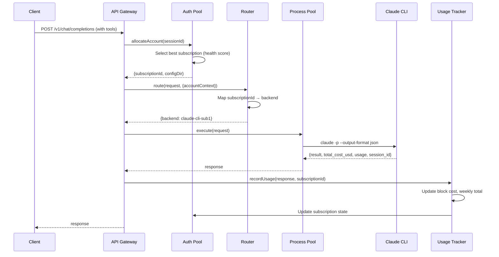

# Auth Pool Module Architecture

**Status:** 🏗️ Design Phase
**Last Updated:** 2026-01-28
**Parent Project:** anthropic-headless-api (Extension Module)

---

## Executive Summary

**PURPOSE:** Intelligent authentication pool manager for multiple Claude subscriptions
**LOCATION:** `src/auth-pool/` (extends existing API)
**INTEGRATION:** Middleware layer before routing decisions
**DATA SOURCE:** Claude CLI JSON output (existing)

---

## System Architecture

### High-Level Flow



### Module Boundaries

```
anthropic-headless-api/
├── src/
│   ├── index.ts                  [MODIFY] Add auth-pool middleware
│   ├── lib/
│   │   ├── router.ts             [MODIFY] Accept accountContext
│   │   ├── backend-registry.ts   [MODIFY] Add subscriptionId field
│   │   ├── claude-cli.ts         [EXISTING] Already provides usage data
│   │   └── auth-pool/            [NEW MODULE - ALL FILES BELOW]
│   │       ├── index.ts          [NEW] Module exports
│   │       ├── subscription-manager.ts     [NEW] CRUD operations
│   │       ├── usage-tracker.ts            [NEW] Parse CLI output
│   │       ├── allocation-balancer.ts      [NEW] Periodic rebalancing
│   │       ├── health-calculator.ts        [NEW] Score algorithm
│   │       ├── session-store.ts            [NEW] Session → subscription map
│   │       ├── notification-manager.ts     [NEW] Webhooks
│   │       └── types.ts                    [NEW] TypeScript interfaces
```

---

## Module Responsibilities

### 1. Subscription Manager (`subscription-manager.ts`)

**Purpose:** Manage subscription lifecycle (CRUD)

**Responsibilities:**
- Load subscriptions from config
- Persist subscription state
- Track subscription metadata
- Validate subscription health

**Public API:**
```typescript
interface SubscriptionManager {
  // Lifecycle
  initialize(config: PoolConfig): Promise<void>
  shutdown(): Promise<void>

  // CRUD
  getSubscription(id: string): Promise<Subscription | null>
  getAllSubscriptions(): Promise<Subscription[]>
  updateSubscription(id: string, updates: Partial<Subscription>): Promise<void>

  // Health
  healthCheck(): Promise<boolean>
}
```

**Dependencies:**
- Storage (Cloudflare KV or Durable Object)
- Configuration file

---

### 2. Usage Tracker (`usage-tracker.ts`)

**Purpose:** Parse Claude CLI JSON output and track usage

**Responsibilities:**
- Extract cost/tokens from CLI response
- Determine active 5-hour block
- Aggregate weekly totals
- Persist usage records

**Public API:**
```typescript
interface UsageTracker {
  // Tracking
  recordUsage(response: ClaudeCliJsonOutput, subscriptionId: string): Promise<UsageRecord>
  getWeeklyUsage(subscriptionId: string): Promise<number>
  getActiveBlock(subscriptionId: string): Promise<BlockInfo | null>

  // Utilities
  getActiveBlockId(timestamp: number): string
}
```

**Data Flow:**
```
ClaudeCliJsonOutput → UsageTracker → UsageRecord → Storage
                    ↓
            Update Subscription State
```

**Dependencies:**
- Claude CLI response (from existing code)
- Storage (usage records)

---

### 3. Allocation Balancer (`allocation-balancer.ts`)

**Purpose:** Periodic rebalancing and allocation decisions

**Responsibilities:**
- Select optimal subscription for new requests
- Rebalance clients across subscriptions
- Enforce safeguards (max clients, budget thresholds)
- Trigger rotation when needed

**Public API:**
```typescript
interface AllocationBalancer {
  // Allocation
  allocateSubscription(request: AllocationRequest): Promise<AllocationResult>
  releaseAllocation(sessionId: string): Promise<void>

  // Rebalancing
  rebalanceAllocations(): Promise<RebalanceReport>
  checkRotationNeeded(sessionId: string): Promise<boolean>

  // Background job
  startBackgroundRebalancing(intervalMs: number): void
  stopBackgroundRebalancing(): void
}
```

**Pseudocode (Allocation):**
```
FUNCTION allocateSubscription(request):
  // 1. Get all subscriptions
  subscriptions = getAllSubscriptions()

  // 2. Filter by safeguards
  available = subscriptions.filter(sub =>
    sub.assignedClients.length < MAX_CLIENTS AND
    (sub.weeklyUsed / sub.weeklyBudget) < THRESHOLD
  )

  IF available.length == 0:
    RETURN fallbackAPI()
  END IF

  // 3. Calculate health scores
  FOR EACH sub IN available:
    sub.healthScore = healthCalculator.calculate(sub)
  END FOR

  // 4. Sort by health (highest = best)
  available.sort((a, b) => b.healthScore - a.healthScore)

  // 5. Select best subscription
  selected = available[0]

  // 6. Assign session
  session = createSession(request.sessionId, selected.id)
  selected.assignedClients.push(session.id)

  RETURN {
    subscriptionId: selected.id,
    configDir: selected.configDir,
    sessionId: session.id
  }
END FUNCTION
```

**Dependencies:**
- SubscriptionManager
- HealthCalculator
- SessionStore

---

### 4. Health Calculator (`health-calculator.ts`)

**Purpose:** Calculate subscription health score

**Responsibilities:**
- Evaluate subscription state
- Factor in cost, clients, burn rate
- Return 0-100 score (higher = healthier)

**Public API:**
```typescript
interface HealthCalculator {
  calculate(subscription: Subscription): number
  explainScore(subscription: Subscription): ScoreBreakdown
}
```

**Pseudocode:**
```
FUNCTION calculate(subscription):
  score = 100

  // Factor 1: Weekly budget usage (50% weight)
  weeklyPercent = (sub.weeklyUsed / sub.weeklyBudget) * 100
  score -= weeklyPercent * 0.5

  // Factor 2: Current block usage (30% weight)
  blockPercent = (sub.currentBlockCost / EXPECTED_BLOCK_COST) * 100
  score -= blockPercent * 0.3

  // Factor 3: Client count (5 points per client)
  score -= sub.assignedClients.length * 5

  // Factor 4: Burn rate penalty
  avgBurnRate = 3.0  // baseline
  IF sub.burnRate > avgBurnRate:
    score -= (sub.burnRate - avgBurnRate) * 2
  END IF

  // Factor 5: Idle bonus
  IF sub.currentBlockCost == 0:
    score += 10
  END IF

  RETURN clamp(score, 0, 100)
END FUNCTION
```

**Dependencies:** None (pure calculation)

---

### 5. Session Store (`session-store.ts`)

**Purpose:** Map client sessions to subscriptions

**Responsibilities:**
- Track active sessions
- Maintain session → subscription mapping
- Handle session expiration
- Support rotation (reassignment)

**Public API:**
```typescript
interface SessionStore {
  // Session management
  createSession(sessionId: string, subscriptionId: string): Promise<ClientSession>
  getSession(sessionId: string): Promise<ClientSession | null>
  updateSession(sessionId: string, updates: Partial<ClientSession>): Promise<void>
  deleteSession(sessionId: string): Promise<void>

  // Queries
  getSessionsBySubscription(subscriptionId: string): Promise<ClientSession[]>
  getActiveSessionCount(subscriptionId: string): Promise<number>

  // Cleanup
  expireStaleS sessions(maxAgeMs: number): Promise<number>
}
```

**Data Model:**
```typescript
interface ClientSession {
  id: string                // Session ID (from client)
  subscriptionId: string    // Assigned subscription
  allocatedAt: number       // Timestamp
  lastActivity: number      // Last request time
  status: 'active' | 'idle' | 'stale'

  // Usage tracking
  sessionCost: number       // Cumulative cost
  sessionTokens: number     // Cumulative tokens
}
```

**Dependencies:**
- Storage (KV or Durable Object)

---

### 6. Notification Manager (`notification-manager.ts`)

**Purpose:** Send notifications for events

**Responsibilities:**
- Webhook notifications
- Sentry error tracking
- Event logging
- Threshold alerts

**Public API:**
```typescript
interface NotificationManager {
  // Event notifications
  notifyRotation(event: RotationEvent): Promise<void>
  notifyFailover(event: FailoverEvent): Promise<void>
  notifyThreshold(event: ThresholdEvent): Promise<void>

  // Health monitoring
  checkAndNotify(subscription: Subscription): Promise<void>
}
```

**Pseudocode:**
```
FUNCTION checkAndNotify(subscription):
  weeklyPercent = subscription.weeklyUsed / subscription.weeklyBudget

  // Check configured rules
  FOR EACH rule IN notificationRules:
    IF rule.type == 'usage_threshold' AND weeklyPercent >= rule.threshold:
      event = {
        type: 'usage_threshold',
        severity: 'warning',
        subscription: subscription.id,
        weeklyPercent: weeklyPercent,
        estimatedTimeRemaining: estimateTime(subscription)
      }

      send(event, rule.channels)  // webhook, sentry, log
    END IF
  END FOR
END FUNCTION
```

**Dependencies:**
- Configuration (notification rules)
- External services (webhook URL, Sentry)

---

## Integration Points

### 1. API Gateway (`src/index.ts`)

**Modification:**
```typescript
// BEFORE routing
import { AuthPoolMiddleware } from './lib/auth-pool';

const authPool = new AuthPoolMiddleware(config);

app.post('/v1/chat/completions', async (req, res) => {
  // EXISTING: Parse request
  const body = parseRequest(req);

  // NEW: Allocate subscription if tool-backend needed
  let accountContext = null;

  IF requiresTools(body) OR body.backend.startsWith('claude-cli'):
    accountContext = await authPool.allocateAccount({
      sessionId: body.session_id,
      estimatedTokens: estimateTokens(body.messages)
    });

    req.accountContext = accountContext;  // Inject into request
  END IF

  // EXISTING: Route request
  const decision = await router.route(body, {
    accountContext: accountContext  // Pass to router
  });

  // EXISTING: Execute
  const response = await router.execute(body, decision);

  // NEW: Report usage after completion
  IF accountContext AND response.claude_metadata:
    await authPool.reportUsage({
      subscriptionId: accountContext.subscriptionId,
      cost: response.claude_metadata.cost,
      tokens: response.claude_metadata.usage
    });
  END IF

  res.json(response);
});
```

### 2. Router (`src/lib/router.ts`)

**Modification:**
```typescript
interface RoutingOptions {
  explicitBackend?: string;
  allowFallback?: boolean;
  accountContext?: {          // NEW
    subscriptionId: string;
    configDir: string;
  };
}

FUNCTION route(request, options):
  // NEW: Use account context to select backend
  IF options.accountContext:
    // Map subscription to backend name
    backendName = mapSubscriptionToBackend(options.accountContext.subscriptionId);

    backend = backendRegistry.getBackend(backendName);

    RETURN {
      backend: backend,
      reason: "Account ${subscriptionId} mapped to ${backendName}"
    }
  END IF

  // EXISTING: Normal routing logic
  ...
END FUNCTION
```

### 3. Backend Registry (`src/lib/backend-registry.ts`)

**Modification:**
```typescript
// Add subscriptionId field to BackendConfig
interface BackendConfig {
  name: string;
  type: string;
  configDir?: string;
  subscriptionId?: string;  // NEW: Link to auth pool account
  ...
}
```

### 4. Configuration (`config/backends.json`)

**Extend:**
```json
{
  "backends": [
    {
      "name": "claude-cli-sub1",
      "type": "claude-cli",
      "configDir": "/Users/vmks/.claude-sub1",
      "subscriptionId": "sub1",
      "maxConcurrent": 10,
      "queueSize": 50
    },
    {
      "name": "claude-cli-sub2",
      "type": "claude-cli",
      "configDir": "/Users/vmks/.claude-sub2",
      "subscriptionId": "sub2",
      "maxConcurrent": 10,
      "queueSize": 50
    }
  ],
  "authPool": {
    "enabled": true,
    "maxClientsPerSubscription": 15,
    "weeklyBudgetThreshold": 0.85,
    "rebalanceInterval": 300000,
    "notificationWebhook": "https://your-webhook.com"
  }
}
```

---

## Data Flow Diagram



---

## Configuration Schema

```yaml
# config/auth-pool.yaml

subscriptions:
  - id: sub1
    email: user1@example.com
    type: claude-pro
    configDir: /Users/vmks/.claude-sub1
    weeklyBudget: 456.00  # USD
    maxClientsPerSubscription: 15

  - id: sub2
    email: user2@example.com
    type: claude-pro
    configDir: /Users/vmks/.claude-sub2
    weeklyBudget: 456.00

safeguards:
  maxClientsPerSubscription: 15
  weeklyBudgetThreshold: 0.85  # 85%
  fallbackWhenExhausted: true

rebalancing:
  enabled: true
  intervalSeconds: 300  # 5 minutes
  costGapThreshold: 5.00  # $5 difference triggers rebalance
  maxClientsToMovePerCycle: 3

notifications:
  webhookUrl: https://your-webhook.com/notify
  sentryDsn: https://your-sentry-dsn

  rules:
    - type: usage_threshold
      threshold: 0.80
      channels: [webhook, log]

    - type: usage_threshold
      threshold: 0.90
      channels: [webhook, sentry]

    - type: failover
      channels: [webhook, sentry]

    - type: rotation
      channels: [log]
```

---

## State Management

### Storage Strategy

**Option 1: Cloudflare Durable Objects** (Recommended for production)
- Single global state
- Strong consistency
- Automatic persistence
- Built-in alarms (for background jobs)

**Option 2: In-Memory + File Persistence** (For development)
- Fast access
- Manual persistence
- Simplicity

### Data Structures

```typescript
// Durable Object storage keys
STORAGE = {
  // Subscriptions
  "subscription:sub1": Subscription,
  "subscription:sub2": Subscription,

  // Sessions
  "session:client123": ClientSession,
  "session:client456": ClientSession,

  // Usage records (time-series)
  "usage:sub1:1738070000000": UsageRecord,
  "usage:sub1:1738070060000": UsageRecord,

  // Indexes
  "index:sessions_by_sub:sub1": ["client123", "client456"],
  "index:usage_by_day:20260128": ["sub1", "sub2"]
}
```

---

## Error Handling

### Failure Scenarios

1. **All subscriptions exhausted**
   - Fallback to API backends (OpenRouter, Anthropic API)
   - Notify via webhook
   - Log event

2. **Subscription rate limited**
   - Mark subscription as `limited`
   - Rotate sessions to other subscriptions
   - Notify

3. **Usage tracking failure**
   - Use stale data (with warning)
   - Continue operation (don't block requests)
   - Retry in background

4. **Backend unavailable**
   - Existing router fallback logic
   - No changes needed

---

## Performance Considerations

### Optimization Strategies

1. **Caching:**
   - Health scores cached for 30 seconds
   - Weekly totals cached for 5 minutes
   - Session lookups cached in memory

2. **Lazy Loading:**
   - Load subscriptions on-demand
   - Don't preload usage history

3. **Batch Operations:**
   - Rebalancing runs in background (doesn't block requests)
   - Usage records written asynchronously

4. **Parallelization:**
   - Health score calculations parallel
   - Availability checks parallel

---

## Testing Strategy

### Unit Tests
- Health calculator (pure logic)
- Usage tracker (mock CLI output)
- Allocation balancer (mock subscriptions)

### Integration Tests
- Full allocation flow (mock storage)
- Rebalancing cycle
- Rotation triggers

### E2E Tests
- Real Claude CLI calls (test accounts)
- Cross-subscription load balancing
- Failover scenarios

---

## Next Steps

1. ✅ Research complete (`ANTHROPIC_USAGE_API_RESEARCH.md`)
2. ✅ Architecture designed (this document)
3. ⏭️ Define data models (`DATA_MODELS.md`)
4. ⏭️ Create project structure (`PROJECT_STRUCTURE.md`)
5. ⏭️ Write pseudocode skeletons (`PSEUDOCODE.md`)
6. ⏭️ Document integration changes (`INTEGRATION_PLAN.md`)
7. ⏭️ Design testing strategy (`TESTING_STRATEGY.md`)

---

**Document Status:** ✅ Architecture Complete - Ready for Data Model Definition
